
<h1 align="center">南阳特产销售平台</h1>

## 简介
南阳特产销售平台：角色分为管理员、商家、用户；支持用户注册登录、商品信息管理、订单管理、公告发布、在线客服、地址选择、特产展示与购买功能，提供高效便捷的电商解决方案。    --计算机毕业设计源码；毕设源码；java毕业设计源码

## 联系方式

<h3 align="center">获取完整代码与数据库文件 + 微信：deepguan QQ: 86050149 QQ群: 783742310</h3>

<h3 align="center">可帮忙远程部署 包运行成功！提供远程部署、修改代码、设计文档指导、代码讲解等服务！</h3>

## 功能介绍（完整见运行截图）
管理员：登录、退出管理系统，管理用户、商家、特产信息、订单和轮播图，编辑公告，查看并修改特产信息，管理系统设置和客服安排，具有订单和特产的信息审核权限。用户：注册、登录网站，查看并修改个人信息、地址、订单和收藏，浏览和搜索特产信息，查看商品详情，添加商品到购物车和结算，使用在线支付功能，发表评论，联系客服进行咨询。商家：登录平台进行商品管理，上架、编辑特产信息，包括名称、类型、产地、生产日期和库存等，管理订单，查看销售数据，提高商品推荐，联系客服和处理用户订单问题。客服：通过在线聊天窗口与用户交流，解决用户疑问，指导用户进行购物和支付，帮助用户完成订单和售后服务，与技术团队沟通处理平台技术问题，维护用户满意度。

## 运行截图
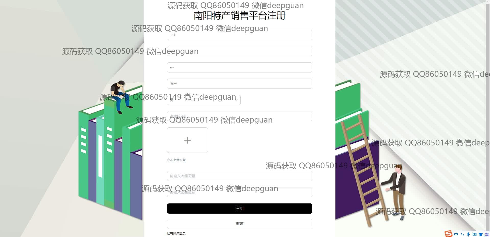

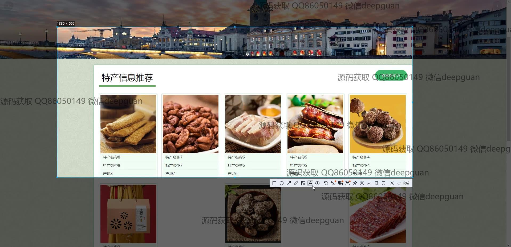
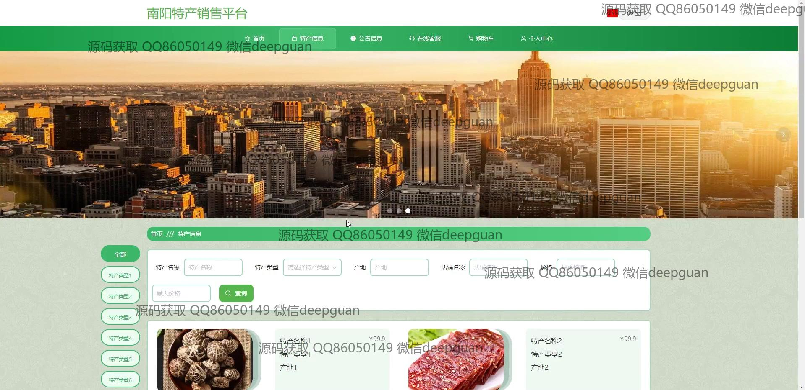
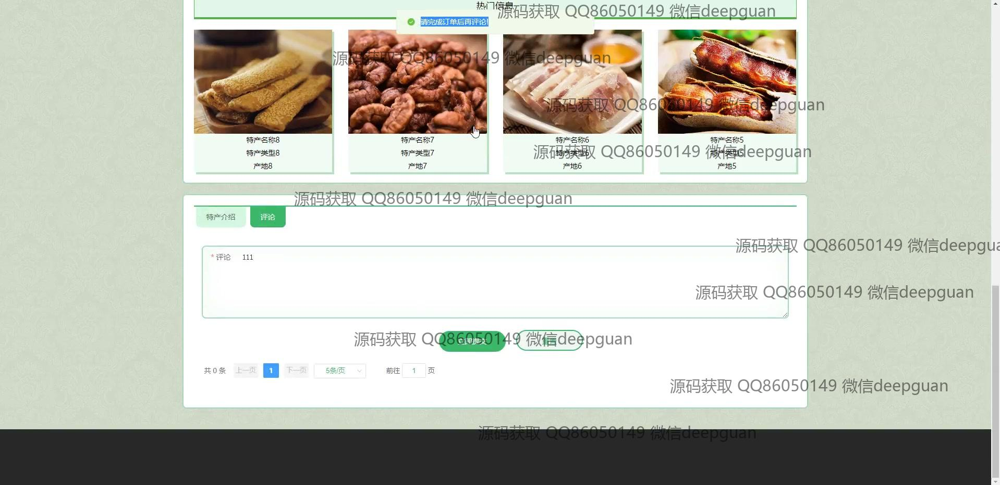
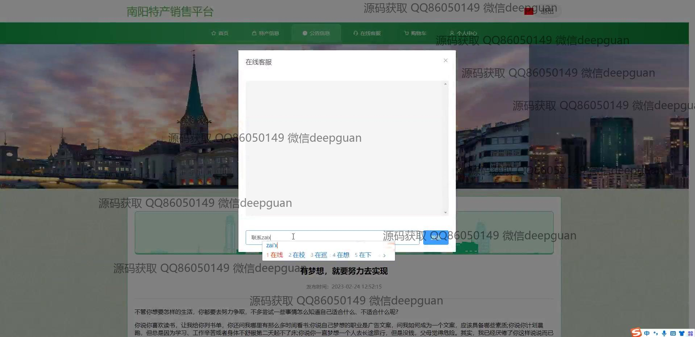
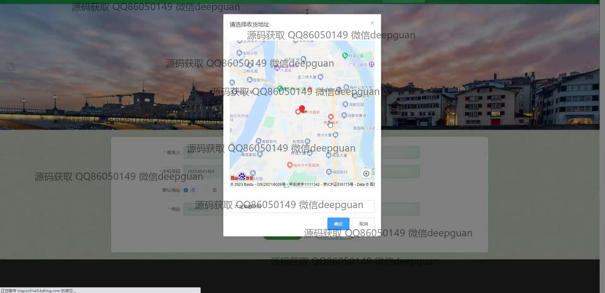
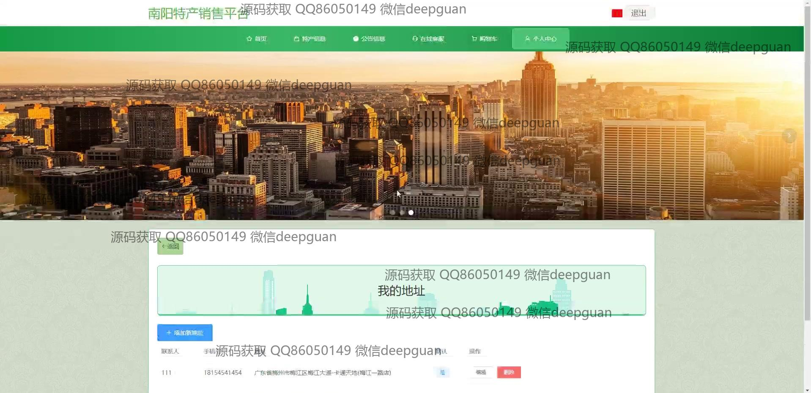
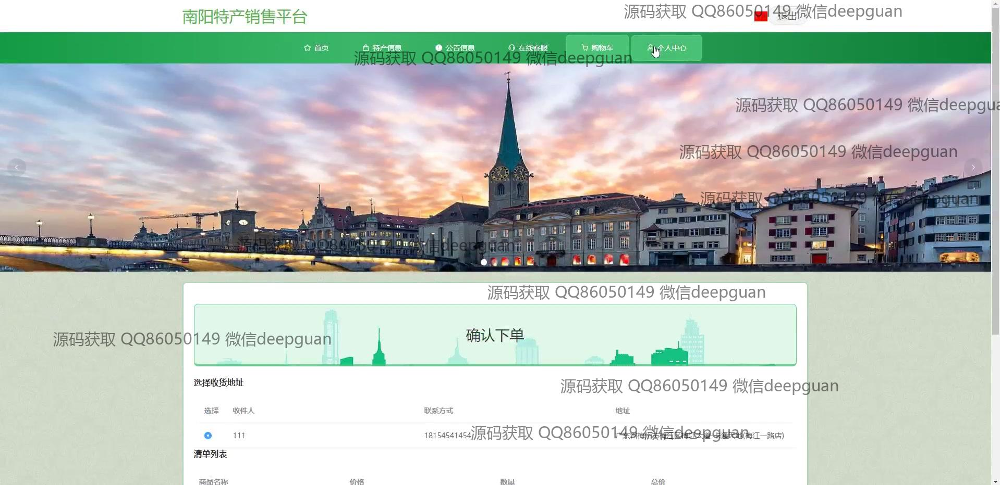
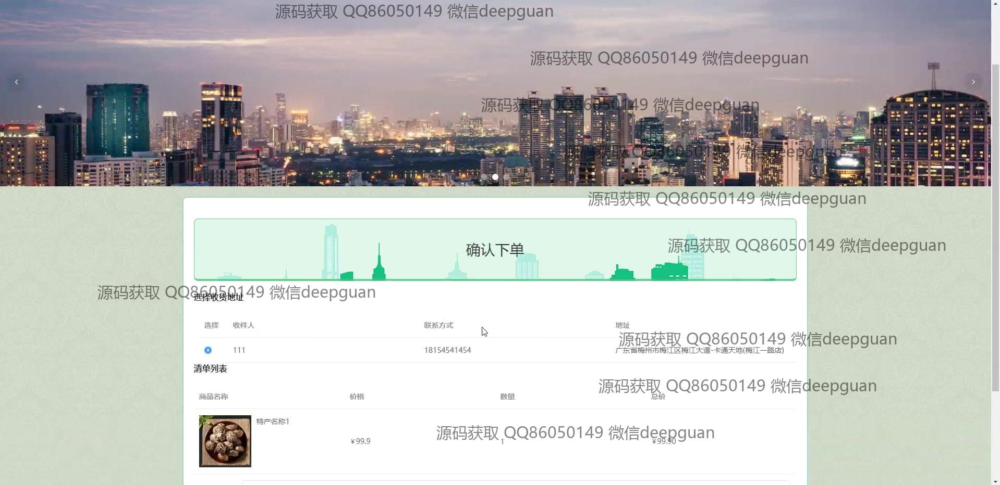
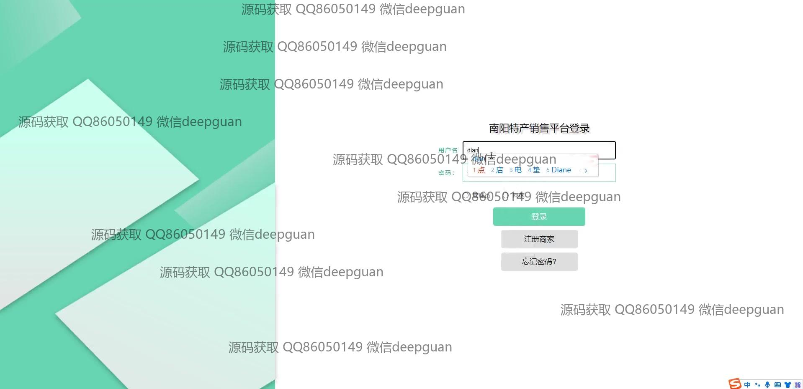

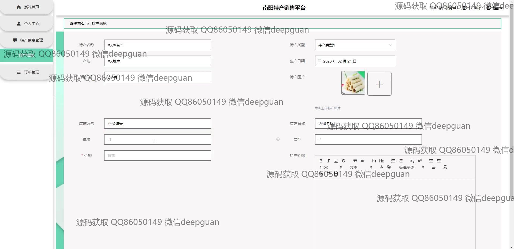
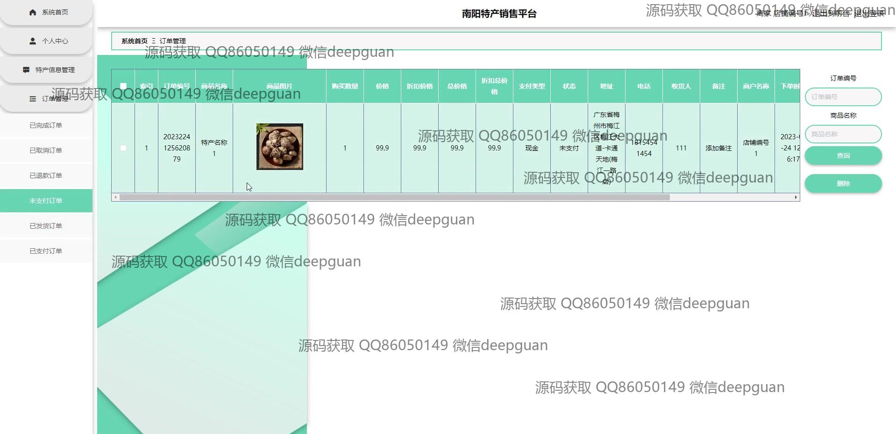
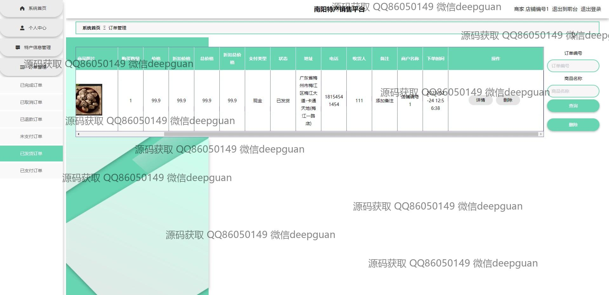
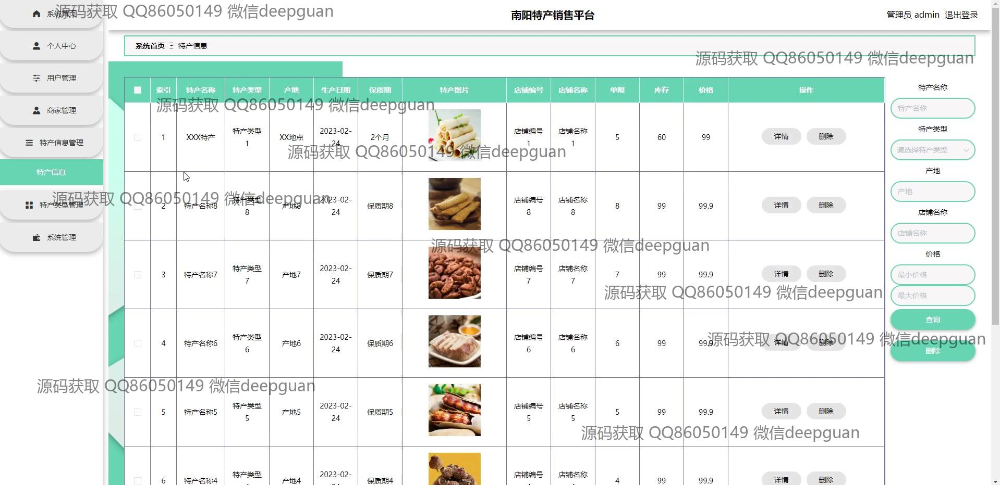

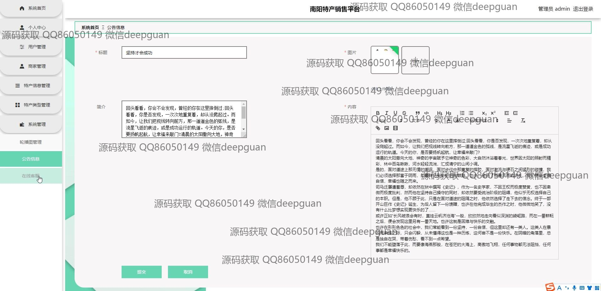
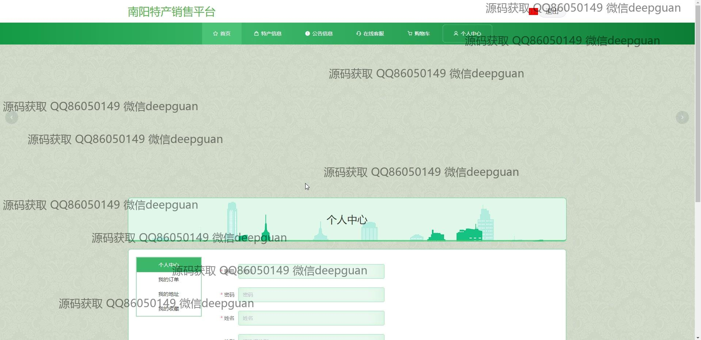
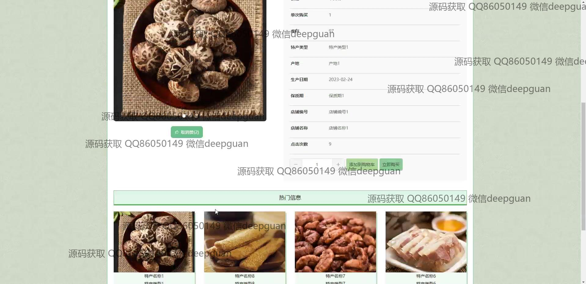

本代码来源于网络,仅供学习参考使用!

